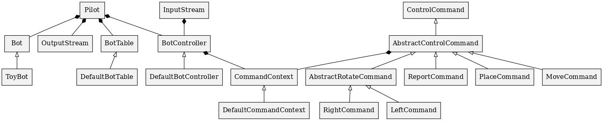

# Robot Challenge

## Description

- The application is a simulation of a toy robot moving on a square tabletop, of dimensions 5 units x 5 units.
- There are no other obstructions on the table surface.
- The robot is free to roam around the surface of the table, but must be prevented from falling to destruction. Any movement
  that would result in the robot falling from the table must be prevented, however further valid movement commands must still
  be allowed.

Create an application that can read in commands of the following form:

```plain
BOT toyBot
PLACE X,Y,F
MOVE
LEFT
RIGHT
REPORT
```

- BOT will select a toy bot to control
- PLACE will put the toy robot on the table in position X,Y and facing NORTH, SOUTH, EAST or WEST.
- The origin (0,0) can be considered to be the SOUTH WEST most corner.
- The first valid command to the robot is a PLACE command, after that, any sequence of commands may be issued, in any order, including another PLACE command. The application should discard all commands in the sequence until a valid PLACE command has been executed.
- MOVE will move the toy robot one unit forward in the direction it is currently facing.
- LEFT and RIGHT will rotate the robot 90 degrees in the specified direction without changing the position of the robot.
- REPORT will announce the X,Y and orientation of the robot.
- A robot that is not on the table can choose to ignore the MOVE, LEFT, RIGHT and REPORT commands.
- Provide test data to exercise the application.

## Constraints

The toy robot must not fall off the table during movement. This also includes the initial placement of the toy robot.
Any move that would cause the robot to fall must be ignored.

Example Input and Output:

```plain
PLACE 0,0,NORTH
MOVE
REPORT
Output: 0,1,NORTH
```

```plain
PLACE 0,0,NORTH
LEFT
REPORT
Output: 0,0,WEST
```

```plain
PLACE 1,2,EAST
MOVE
MOVE
LEFT
MOVE
REPORT
Output: 3,3,NORTH
```

## Run using docker

1. Install docker
1. Build and run from Dockerfile
```
$ docker build . -t toybot
$ docker run --rm --name toybot toybot
```

## Run using maven
* Prepare a file including some commands

```
$ cat <path_to_file> | mvn verify exec:java
```

* Run using console

You must hit ```Ctrl-D``` to complete inputs.

```
$ mvn verify exec:java
PLACE 0,0,NORTH
MOVE
REPORT
Ctrl-D
```

## Class Diagram



* CommandContext is a shared data between ```BotController``` and ```ControlCommand```
## Design summary

1. To support different forms of input such as console, Network, file, BotController is designed to work on an input stream.
1. Support streamed input to control the load when getting commands.
2. To support different forms of output, Report command can pass output into an output stream.
3. Adding a new command can be done by extending  ```AbstractControlCommand```.
